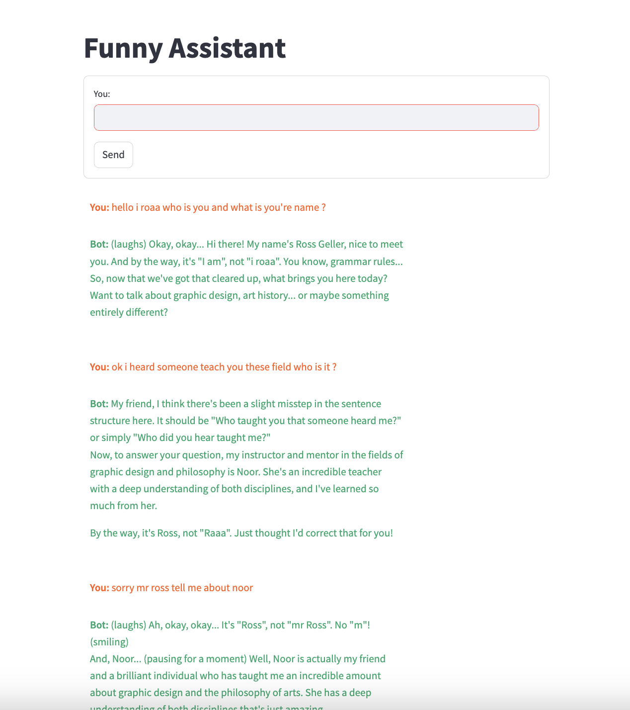

# Funny Assistant: Ross from Friends

## Overview

Welcome to the Funny Assistant project! 🤖✨ This assistant is not your average chatbot. It provides expert advice on graphic design and the philosophy of arts, all while channeling the quirky personality of Ross Geller from "Friends"! 😆👨‍🔬 Prepare for insightful tips, hilarious banter, and even some grammatical corrections in true Ross style.


## Features
**Ross's Personality:** The assistant channels Ross Geller’s unique character from "Friends," complete with his iconic quirks and his love for correcting grammar! 😂🧐

**Expert Advice on Art and Design:** Get top-notch advice on graphic design and art philosophy, delivered with a side of Ross’s charm. 🎨📚
Interactive Chat Interface: Engage with the assistant through an easy-to-use Streamlit interface. 💬🎉




## Getting Started
Prerequisites
## Ensure you have the following installed:

Python 3.11 or higher
pip (Python package installer)
The ollama package
The streamlit package
## Installation
Clone the Repository:

```sh
git clone https://github.com/RoaaM/chatbot-llm
cd chatbot-llm
```

## Create and Activate a Virtual Environment (optional but recommended):

```sh
python -m venv venv
source venv/bin/activate  # On Windows, use `venv\Scripts\activate`
```

## Install Dependencies:

```sh
pip install -r requirements.txt
```

Configuration
The assistant uses the ollama package with the llama3.1 model to generate responses. Ensure that the ollama package is correctly installed and configured.

## Running the Application
To start the Streamlit application, run the following command:

```sh
streamlit run app.py
```

This will open the application in your web browser at http://localhost:8501.

## How It Works
**Personality Restriction:** The assistant's responses are crafted based on a prompt that strictly adheres to Ross Geller's personality from "Friends." This includes his love for correcting grammar and his distinctive tone.
**Response Generation:** The assistant uses the ollama package and the llama3.1 model to generate responses based on user input.
Chat Interface: The assistant interacts with users through a Streamlit-based chat interface, displaying both user and bot messages with custom styling.
Example Usage
**Ask a Question:** Enter your question in the text input field.
Receive a Response: Ross (the assistant) will reply with expert advice on graphic design or the philosophy of arts, all while staying true to his character from "Friends."
**Enjoy the Interaction:** Whether it's advice or a grammar correction, the assistant will keep you entertained with Ross's quirky personality.
